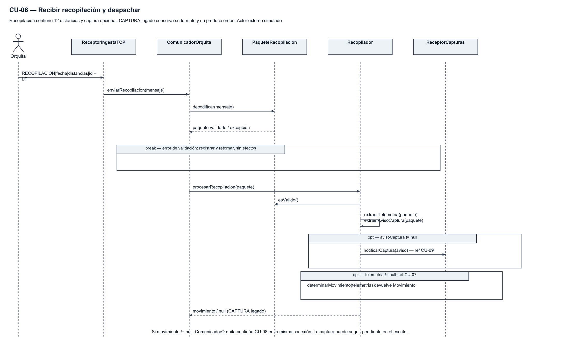
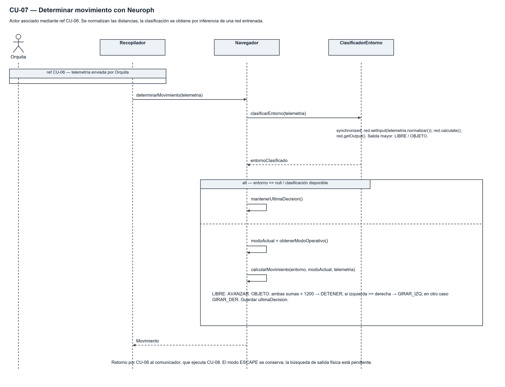
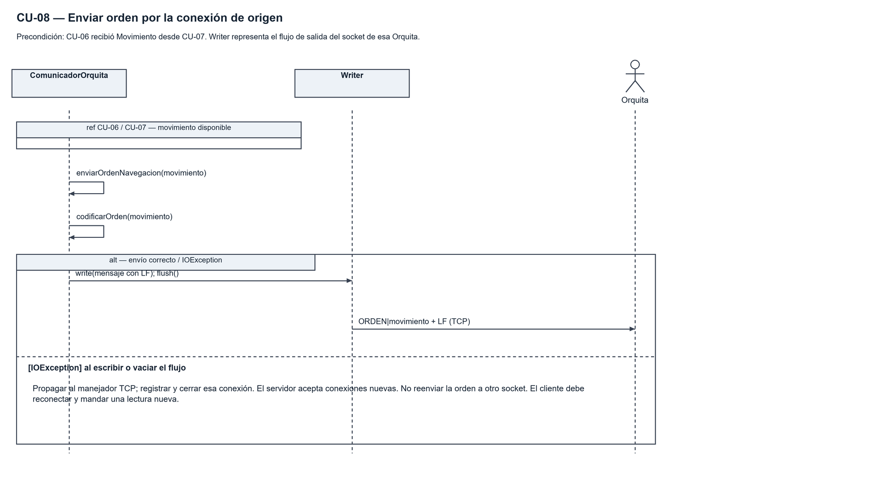
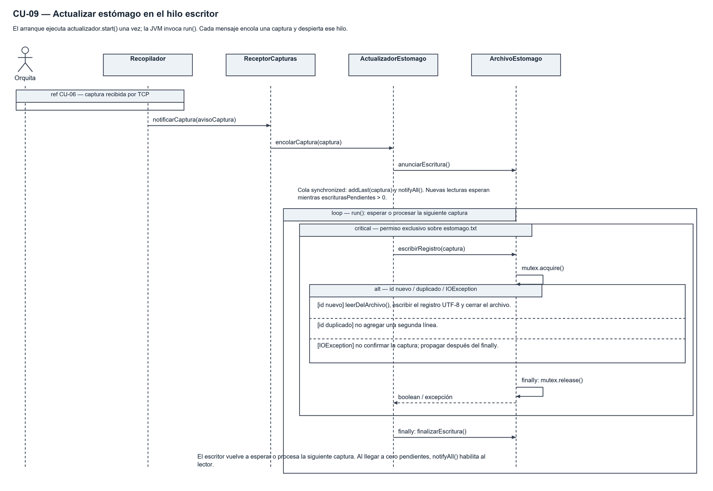
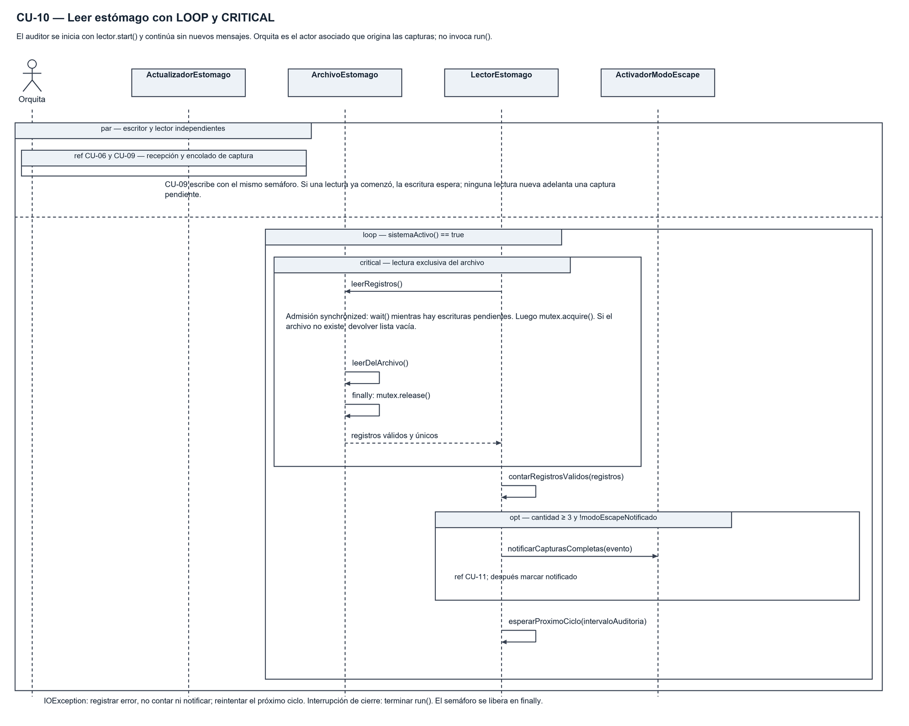
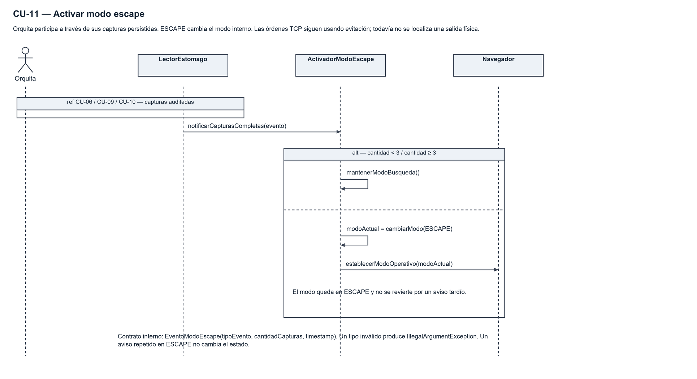

# Secuencias vigentes — Hito 2 preliminar

Cada imagen tiene un archivo .drawio con el mismo nombre. El archivo combinado es [Orquitas_Hito2.drawio](diagramas/Orquitas_Hito2.drawio). El actor Orquita se representa como actor externo; no se diseña su módulo interno.

## CU-06 — Recibir recopilación

Orquita → ReceptorIngestaTCP (línea TCP) → ComunicadorOrquita.enviarRecopilacion(String). PaqueteRecopilacion.decodificar(String) valida la trama completa. Recopilador.procesarRecopilacion(PaqueteRecopilacion) extrae datos, notifica captura opcional y llama a CU-07 si hay telemetría. Retorna Movimiento al comunicador; null para CAPTURA legado. El comunicador continúa CU-08. Una excepción de formato se descarta antes de persistir.

## CU-07 — Determinar movimiento

Navegador.determinarMovimiento(Telemetria) → ClasificadorEntorno.clasificarEntorno(Telemetria). ALT nulo: mantenerUltimaDecision(). ELSE: obtenerModoOperativo(), calcularMovimiento(EntornoClasificado, ModoOperativo, Telemetria), guardar y retornar Movimiento. El comunicador conserva el destino de la respuesta: Navegador no posee un socket global.

## CU-08 — Enviar orden

ComunicadorOrquita.enviarOrdenNavegacion(Movimiento) → codificarOrden(Movimiento) → Writer.write/flush → Orquita. IOException propaga al manejador que cierra la conexión. El servidor continúa aceptando nuevos clientes; una nueva lectura genera otra decisión. Se eliminó del diseño el bucle de reconexión sin destino de la versión anterior.

## CU-09 — Actualizar estómago

El actor inicia CU-06. ReceptorCapturas.notificarCaptura(AvisoCaptura) crea Captura y llama ActualizadorEstomago.encolarCaptura(Captura), que anuncia la escritura y despierta el hilo permanente. run() procesa dentro de LOOP. ArchivoEstomago.escribirRegistro protege con Semaphore el acceso CRITICAL. finally libera el permiso; finalmente el escritor llama finalizarEscritura(). IOException no confirma, duplicado no suma; el hilo continúa.

## CU-10 — Leer estómago

PAR entre escritor y auditor. El lector permanece en LOOP desde el arranque. leerRegistros espera escrituras pendientes, adquiere el mismo semáforo, lee en CRITICAL y libera en finally. Luego contarRegistrosValidos. OPT cantidad >= 3 y no notificado: notificarCapturasCompletas(EventoModoEscape). Espera el próximo ciclo. Una lectura fallida no produce conteo parcial ni evento.

## CU-11 — Activar escape

ActivadorModoEscape valida el evento, ignora repetidos si ya está en ESCAPE y resuelve ALT cantidad < 3 / >= 3. cambiarModo(ESCAPE) y Navegador.establecerModoOperativo(ModoOperativo) actualizan el estado interno. La demostración sigue evitando obstáculos; localizar la salida es un pendiente.

## Diferencias explícitas respecto del material recibido

Se conserva el escritor permanente con cola, no un hilo nuevo por captura. Las funciones de decisión devuelven Movimiento para que la respuesta vuelva al mismo cliente. calcularMovimiento recibe Telemetria para comparar los laterales. Todos estos cambios figuran también en el DCU, las clases y el código. No son diagramas literalmente idénticos a las versiones antiguas: son las vistas de esta implementación.
