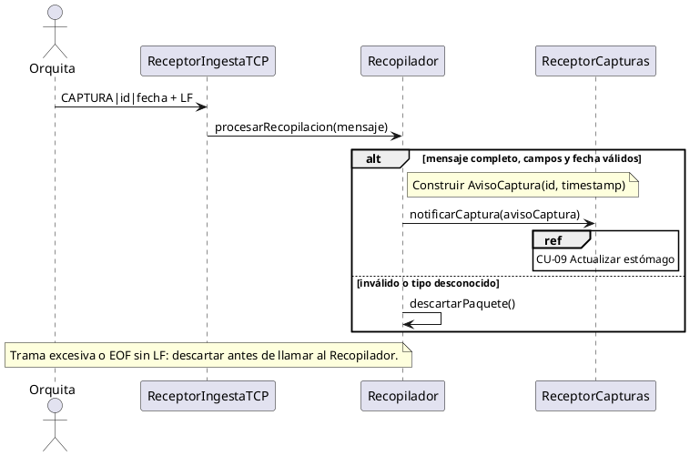
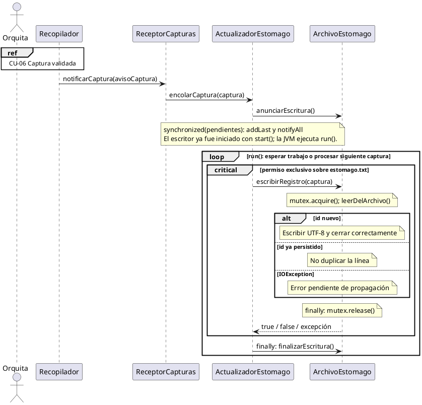
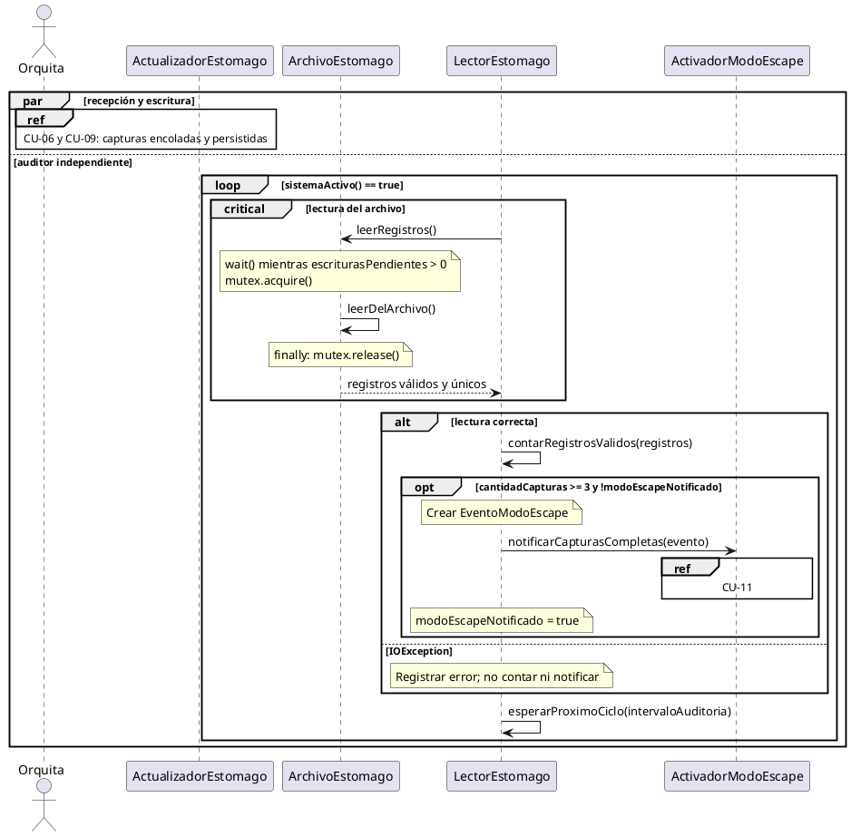
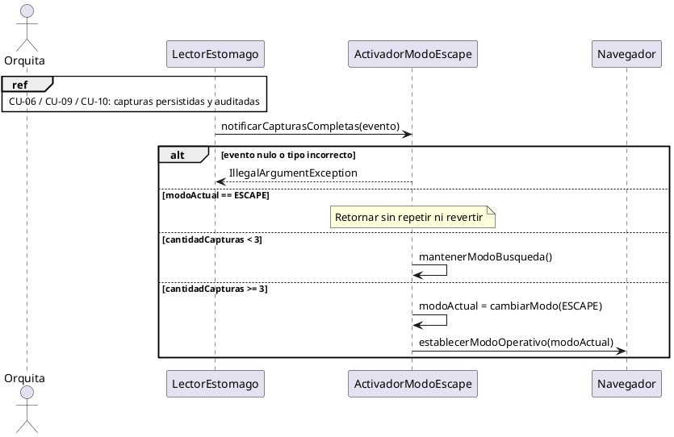

# Vistas de secuencia del módulo servidor

## Alcance y actor

La Linareada implementa CU-06 sólo para capturas, CU-09, CU-10 y CU-11. El actor es Orquita y aparece en todas las vistas. Los fragmentos `ref` muestran cómo sus capturas originan las operaciones internas; no inventan llamadas del robot a `run()`.

Las imágenes y los editables draw.io están en `entrega-linareada-corregida/diagramas`. No se documenta el interior del simulador cliente. CU-07, CU-08 y CU-12 pertenecen al diseño completo y no se presentan como implementados en este recorte.

## CU-06 Recibir recopilación de capturas

## CU-09 Actualizar estómago

La cola organiza solicitudes. El número de pendientes nunca decide el modo. Al cerrar se drena la cola; un error de disco se registra sin confirmar y no se reintenta automáticamente. Si se interrumpe la espera del permiso, el aviso se reencola para cerrar ordenadamente.

## CU-10 Leer estómago

El LOOP se inicia con el servidor y sigue sin mensajes nuevos. Una lectura en curso puede terminar antes de una captura recién anunciada; las siguientes lecturas esperan las escrituras pendientes. El cierre interrumpe al lector y termina su ciclo.

## CU-11 Activar modo escape

El evento contiene tipoEvento, cantidadCapturas y timestamp. No existe una llamada sin argumentos a notificarCapturasCompletas. Este hito cambia el modo interno y no simula que ya navega hacia una salida física.
